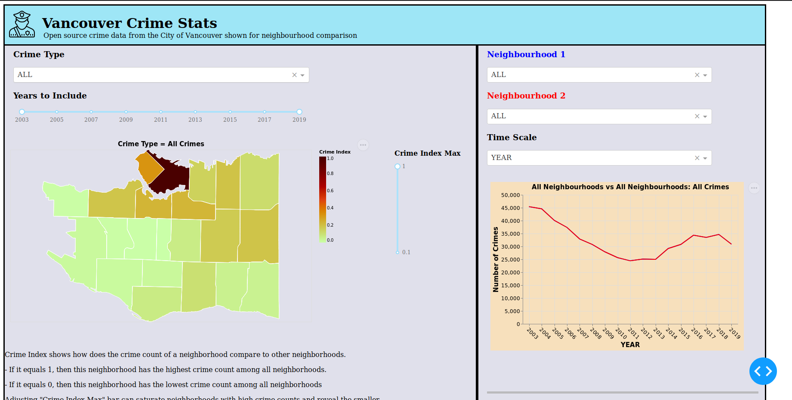

# Vancouver Crime Landscape

 

## APP Link
https://vancouver-crime-stats.herokuapp.com/

## APP Screenshot

## Description of APP  
This APP shows Vancouver's historical crime data in geo-temporal form. It displays a choropleth of City of Vancouver for showing neighbourhood crime comparisons and a line chart for showing individual neighbourhood crime trends.
  
On the choropleth (crime map), the number of crimes in different neighbourhoods is normalized and colour-coded so that users relate the count of a crime type to its relative location in Vancouver. A dropdown list is provided for choosing the crime type. There is also a slider bar for changing the year range of the crime data in case some users are interested in more recent crime data. A second slider bar is provided to change the color saturation of the choropeth to different maximum crime indexes. This allows the user to remove high crime neighbourhood outliers and still show color comparisons for lower crime neighbourhoods.
  
In the line chart (crime trend chart), the count of crimes in a neighbourhood is shown as varied over a time scale. Two dropdowns are provided for selecting two neighbourhoods, and another for selecting the time scale.

## Description of Data

The dataset that we choose to visualize is a public dataset that can be downloaded from the Vancouver Police Department's Open Data: https://geodash.vpd.ca/opendata/. It is a collection of types, locations, dates and times of crimes occurred in City of Vancouver for the past 16 years. The earliest date in the dataset is January 1, 2003, and the latest date is October 31, 2019.  
  
This dataset is available to the public and no special permit or registration is required.  As it contains temporal-spatial information of crimes, it can be a great guidance to policy makers for laying out community development plans.  As an individual living in Vancouver like ourselves, it can also serve as a reference for selecting residence.

There are 622,221 crime records in this dataset, and each crime record contains: (`TYPE`, `YEAR`, `MONTH`, `DAY`, `HOUR`, `MINUTE`, `HUNDRED_BLOCK`, `NEIGHBOURHOOD`, `X`, `Y`) columns . (`TYPE`) specifies 11 types of crimes (‘Break and Enter Commercial', 'Break and Enter Residential/Other', 'Homicide', 'Mischief', 'Offence Against a Person', 'Other Theft', 'Theft from Vehicle', 'Theft of Bicycle', 'Theft of Vehicle', 'Vehicle Collision or Pedestrian Struck (with Fatality)', 'Vehicle Collision or Pedestrian Struck (with Injury)'), and (`YEAR`, `MONTH`, `DAY`, `HOUR` and `MINUTE`) columns specify the date and time when the reported crime occurred.  To indicate the location of the crimes, we have (`HUNDRED_BLOCK` and `NEIGHBORHOOD`).  (`X` and `Y`) provides the coordinates in UTM Zone 10 format and will need to be converted into longitude and latitude if we want to render a map with GeoJSON.

## Functionalities
- Crime Type: A drop down box that lets the user select the crime types occuring from 2003 to 2018. Default crime is all crime types combined together.
- Years to Include: From 2003 to 2018. Select the year ranges. Default year range is from 2003 to 2018.
- Neighbourhood 1: Neighbourhoods in Vancouver. Default is all neighbourhoods.
- Neighbourhood 2: Neighbourhoods in Vancouver. Default is all neighbourhoods.
- Time Scale: Select from year, month, day of the week or hour. Default time scale is year.
- The Crime Index: A threshold that change the colour across all neighbourhoods in Vancouver. Default threshold is 1.

